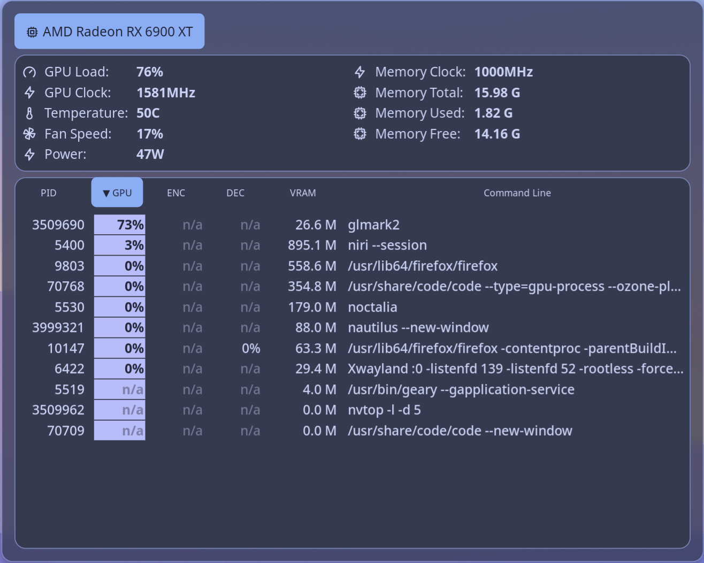

# NVTOP

Monitor real-time information about your GPU status and running processes with nvtop.

# Features

* Uses `nvtop` to monitor real-time information about your GPU status.
* Support for multiple GPUs
* View processes using the GPU
* Process columns: **PID**, **GPU Usage**, **Video Encoder Usage**, **Video Decoder Usage**, **GPU Memory Usage**, and **Command Line**
* Sort processes by any column by clicking its header
* Customizable polling interval
* Customizable colors for the sorted column
* The plugin runs `nvtop` when the panel is opened and closes it when the panel is closed. This helps you save resources.



## Plugin

| Field | Value |
| --- | --- |
| ID | `tordex/nvtop` |
| Entries | Panel: `panel` |

## Requirements

The plugin requires `nvtop`, `jq`, and `pkill` to be installed and available in `$PATH`.

## Usage

You can open the panel by binding it in your compositor or by setting the action for `sysmon` widgets:


```toml
[widget.GPU_Usage]
stat = "gpu_usage"
type = "sysmon"

    [widget.GPU_Usage.actions]
    left = "panel-toggle tordex/nvtop:panel gpu"

[widget.GPU_VRAM]
stat = "gpu_vram_used"
type = "sysmon"

    [widget.GPU_VRAM.actions]
    left = "panel-toggle tordex/nvtop:panel mem"
```

To open the panel from the command line, use:

```sh
noctalia msg panel-toggle tordex/nvtop:panel [order_by]
```

Possible values for `order_by`:

| `order_by` value   | Effect                        |
|--------------------|-------------------------------|
| `pid`              | Order by Process ID (PID)     |
| `gpu`              | Order by GPU Usage            |
| `enc`              | Order by Video Encoder Usage  |
| `dec`              | Order by Video Decoder Usage  |
| `mem`              | GPU Memory Usage              |
| `cmd`              | Order by Process Command Line |

Without `order_by`, the panel opens with the previous sort mode.

Add `-` before `order_by` to reverse the sort order. For example:

```sh
noctalia msg panel-toggle tordex/nvtop:panel -mem
```

## Settings

| Setting | Type | Default | Description |
| --- | --- | --- | --- |
| `delay` | `int` | `5` | Refresh rate. 1 == 0.1s. Valid values 1-20 |
| `sort_column_background` | `color` | `secondary` | The background color for the sort column. |
| `sort_column_color` | `color` | `on_secondary` | The text color for the sort column. |

