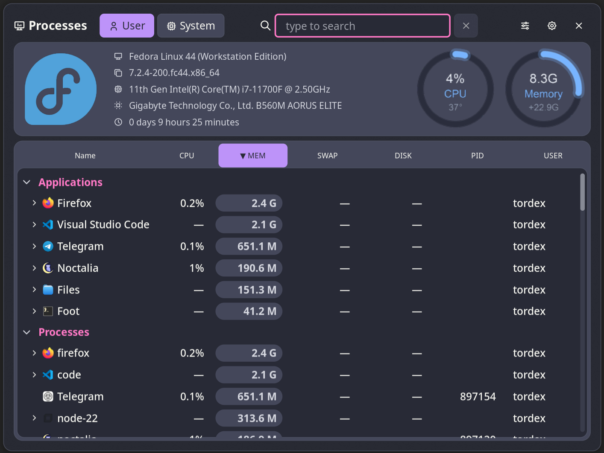

# Processes

Monitor CPU, memory, disk read/write, and other process metrics.

## Features

* Group processes by application. Supported compositors: Niri, Umbriel, Hyprland, Mango, Sway, and Scroll.
* Group processes by executable path.
* Show user and system processes.
* Process columns: **Name**, **CPU Usage**, **Memory Usage**, **Swap Usage**, **Disk read/write bytes**, **PID**, and **Process user**.
* Click a process to view extended process information and buttons for killing it. Click a value to copy it to the clipboard.
* Kill a process with SIGINT or terminate it with SIGKILL.
* Show system information: **Distro name**, **Kernel version**, **CPU name**, **Motherboard name**, and **Uptime**.
* Customizable polling interval.
* Customizable colors for the sorted column.
* Show graphical gauges for CPU and memory usage.
* The plugin starts statistics collection when the panel opens and stops it when the panel closes. This helps save resources.



## Plugin

| Field | Value |
| --- | --- |
| ID | `tordex/processes` |
| Entries | Panel: `panel` |

## Requirements

The plugin requires `python` to run the statistics collection script. You must install the `psutil`, `Pillow`, and `PyGObject` modules with `pip`:

```sh
pip install PyGObject psutil Pillow
```

The `kill` and `pkill` commands must also be installed and available in `$PATH`.

Other requirements depend on the compositor you use:

| Compositor | Dependencies |
| --- | --- |
| Niri | `niri` |
| Umbriel | `umbriel` |
| Hyprland | `hyprctl` |
| Sway | `swaymsg`, `jq` |
| Scroll | `scrollmsg`, `jq` |
| Mango | `mmsg` |


## Usage

You can open the panel by binding it in your compositor or by setting an action for `sysmon` widgets:


```toml
[widget.ram.actions]
left = "panel-toggle tordex/processes:panel mem"

[widget.cpu.actions]
left = "panel-toggle tordex/processes:panel cpu"
```

To open the panel from the command line, use:

```sh
noctalia msg panel-toggle tordex/processes:panel [order_by]
```

Possible values for `order_by`:

| `order_by` value | Effect |
| --- | --- |
| `pid` | Sort by Process ID (PID) |
| `name` | Sort by Process Name |
| `cpu` | Sort by CPU Usage |
| `mem` | Sort by Memory Usage |
| `swap` | Sort by Swap Usage |
| `io` | Sort by Disk read/write bytes |
| `username` | Sort by Process user |

Without `order_by`, the panel opens using the previous sort mode.

Add `-` before `order_by` to reverse the sort order. For example:

```sh
noctalia msg panel-toggle tordex/processes:panel -mem
```


## Settings

| Setting | Type | Default | Description |
| --- | --- | --- | --- |
| `delay` | `int` | `1` | Refresh rate in seconds. |
| `sort_column_background` | `color` | `surface_variant` | Background color for the sorted column. |
| `sort_column_color` | `color` | `on_surface_variant` | Text color for the sorted column. |
| `process_hover_background` | `color` | `surface_variant` | Background color for the hovered row. |
| `process_hover_color` | `color` | `on_surface_variant` | Text color for the hovered row. |
| `show_apps` | `bool` | `true` | Show applications section. |
| `show_processes` | `bool` | `true` | Show processes section. |

## Notes

The panel writes some files to the `${XDG_RUNTIME_DIR}` directory when it is opened:

| File name | Description |
| --- | --- |
| `noctalia_tordex_procs.json` | The information about processes and system. |
| `noctalia_tordex_procs_cpu_usage.png` | Gauge for CPU usage |
| `noctalia_tordex_procs_mem_usage.png` | Gauge for memory usage |

These files are deleted when the panel closes.

The `Application` section in the process list is available with the following supported compositors:
* Niri
* Umbriel
* Hyprland
* Sway
* Scroll
* Mango

## Third-party notice

The `scripts/stats.py` script includes code from [ps_mem](https://github.com/pixelb/ps_mem), which is licensed under the [LGPL-2.1 license](https://www.gnu.org/licenses/old-licenses/lgpl-2.1.html).
